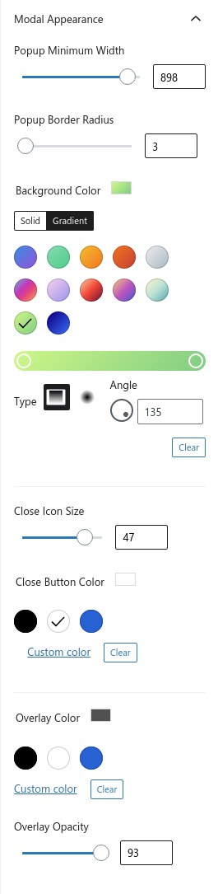
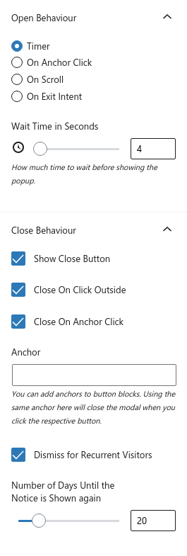

# Popup Block

A popup/modal block for the WordPress block editor.

  

## Overview

This plugin adds a customizable Popup Block to the WordPress block editor.

## Requirements
* [WordPress](http://wordpress.org/) 5.5+

## Installation

1. Install the plugin via the plugin installer, either by searching for it or uploading a .ZIP file.
1. Activate the plugin.
1. Use the Popup Block for WordPress!

## Appearance Options

## Open/Close Advanced Options

